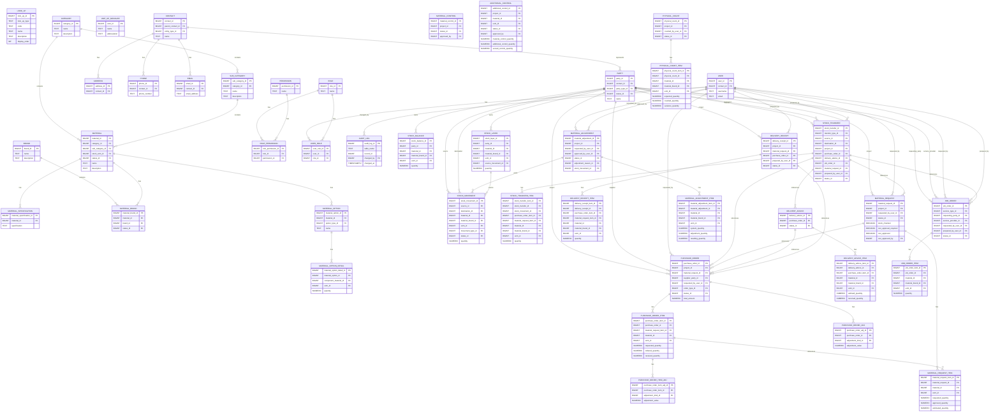

# MMS ERD Diagram

This file contains a Mermaid ERD representation of the MMS schema.

```mermaid
erDiagram
    LOOK_UP {
        BIGINT look_up_id PK
        TEXT look_up_type
        TEXT code
        TEXT name
        TEXT description
        INT display_order
    }

    CATEGORY {
        BIGINT category_id PK
        TEXT name
        TEXT description
    }

    SUB_CATEGORY {
        BIGINT sub_category_id PK
        BIGINT category_id FK
        TEXT name
        TEXT description
    }

    BRAND {
        BIGINT brand_id PK
        TEXT name
        TEXT description
    }

    UNIT_OF_MEASURE {
        BIGINT uom_id PK
        TEXT name
        TEXT abbreviation
    }

    MATERIAL {
        BIGINT material_id PK
        BIGINT category_id FK
        BIGINT sub_category_id FK
        BIGINT stock_uom_id FK
        BIGINT status_id FK
        TEXT name
        TEXT description
    }

    MATERIAL_SPECIFICATION {
        BIGINT material_specification_id PK
        BIGINT material_id FK
        TEXT specification
    }

    MATERIAL_BRAND {
        BIGINT material_brand_id PK
        BIGINT material_id FK
        BIGINT brand_id FK
        BIGINT status_id FK
    }

    MATERIAL_OPTION {
        BIGINT material_option_id PK
        BIGINT material_id FK
        BIGINT option_type_id FK
        TEXT name
    }

    MATERIAL_OPTION_DETAIL {
        BIGINT material_option_detail_id PK
        BIGINT material_option_id FK
        BIGINT component_material_id FK
        BIGINT uom_id FK
        NUMERIC quantity
    }

    CONTACT {
        BIGINT contact_id PK
        BIGINT parent_contact_id FK
        BIGINT entity_type_id FK
        TEXT name
    }

    ADDRESS {
        BIGINT address_id PK
        BIGINT contact_id FK
    }

    PHONE {
        BIGINT phone_id PK
        BIGINT contact_id FK
        TEXT phone_number
    }

    EMAIL {
        BIGINT email_id PK
        BIGINT contact_id FK
        TEXT email_address
    }

    PARTY {
        BIGINT party_id PK
        BIGINT contact_id FK
        BIGINT party_type_id FK
        BIGINT status_id FK
        TEXT name
    }

    USER {
        BIGINT user_id PK
        BIGINT contact_id FK
        TEXT username
        TEXT email
    }

    ROLE {
        BIGINT role_id PK
        TEXT name
    }

    PERMISSION {
        BIGINT permission_id PK
        TEXT name
    }

    ROLE_PERMISSION {
        BIGINT role_permission_id PK
        BIGINT role_id FK
        BIGINT permission_id FK
    }

    USER_ROLE {
        BIGINT user_role_id PK
        BIGINT user_id FK
        BIGINT role_id FK
    }

    AUDIT_LOG {
        BIGINT audit_log_id PK
        TEXT table_name
        BIGINT record_id
        BIGINT changed_by FK
        TIMESTAMPTZ changed_at
    }

    STOCK_MOVEMENT {
        BIGINT stock_movement_id PK
        BIGINT source_id FK
        BIGINT destination_id FK
        BIGINT material_id FK
        BIGINT material_brand_id FK
        BIGINT uom_id FK
        BIGINT movement_type_id FK
        BIGINT status_id FK
        NUMERIC quantity
    }

    STOCK_BALANCE {
        BIGINT stock_balance_id PK
        BIGINT party_id FK
        BIGINT material_id FK
        BIGINT material_brand_id FK
        BIGINT uom_id FK
        NUMERIC quantity
    }

    STOCK_LAYER {
        BIGINT stock_layer_id PK
        BIGINT party_id FK
        BIGINT material_id FK
        BIGINT material_brand_id FK
        BIGINT uom_id FK
        BIGINT source_movement_id FK
        NUMERIC quantity
    }

    STOCK_TRANSFER {
        BIGINT stock_transfer_id PK
        BIGINT transfer_type_id FK
        BIGINT source_id FK
        BIGINT destination_id FK
        BIGINT project_id FK
        BIGINT purchase_order_id FK
        BIGINT delivery_advice_id FK
        BIGINT job_order_id FK
        BIGINT material_request_id FK
        BIGINT prepared_by_user_id FK
        BIGINT status_id FK
    }

    STOCK_TRANSFER_ITEM {
        BIGINT stock_transfer_item_id PK
        BIGINT stock_transfer_id FK
        BIGINT stock_movement_id FK
        BIGINT purchase_order_item_id FK
        BIGINT material_request_item_id FK
        BIGINT material_id FK
        BIGINT material_brand_id FK
        BIGINT uom_id FK
        NUMERIC quantity
    }

    MATERIAL_CONTROL {
        BIGINT material_control_id PK
        BIGINT project_id FK
        BIGINT status_id FK
        BIGINT approved_by FK
    }

    ADDITIONAL_CONTROL {
        BIGINT additional_control_id PK
        BIGINT project_id FK
        BIGINT material_id FK
        BIGINT uom_id FK
        BIGINT status_id FK
        BIGINT approved_by FK
        NUMERIC material_control_quantity
        NUMERIC additional_control_quantity
        NUMERIC served_control_quantity
    }

    MATERIAL_REQUEST {
        BIGINT material_request_id PK
        BIGINT project_id FK
        BIGINT requested_by_user_id FK
        BIGINT status_id FK
        BOOLEAN stock_checked
        BOOLEAN ceo_approval_required
        BOOLEAN ceo_approved
        BIGINT ceo_approved_by FK
    }

    MATERIAL_REQUEST_ITEM {
        BIGINT material_request_item_id PK
        BIGINT material_request_id FK
        BIGINT material_id FK
        BIGINT uom_id FK
        NUMERIC requested_quantity
        NUMERIC approved_quantity
        NUMERIC estimated_quantity
    }

    PURCHASE_ORDER {
        BIGINT purchase_order_id PK
        BIGINT project_id FK
        BIGINT material_request_id FK
        BIGINT supplier_party_id FK
        BIGINT requested_by_user_id FK
        BIGINT order_type_id FK
        BIGINT status_id FK
        NUMERIC total_amount
    }

    PURCHASE_ORDER_ITEM {
        BIGINT purchase_order_item_id PK
        BIGINT purchase_order_id FK
        BIGINT material_request_item_id FK
        BIGINT material_id FK
        BIGINT uom_id FK
        NUMERIC requested_quantity
        NUMERIC ordered_quantity
        NUMERIC received_quantity
    }

    PURCHASE_ORDER_ADJ {
        BIGINT purchase_order_adj_id PK
        BIGINT purchase_order_id FK
        BIGINT adjustment_kind_id FK
        NUMERIC adjustment_value
    }

    PURCHASE_ORDER_ITEM_ADJ {
        BIGINT purchase_order_item_adj_id PK
        BIGINT purchase_order_item_id FK
        BIGINT adjustment_kind_id FK
        NUMERIC adjustment_value
    }

    DELIVERY_RECEIPT {
        BIGINT delivery_receipt_id PK
        BIGINT project_id FK
        BIGINT material_request_id FK
        BIGINT purchase_order_id FK
        BIGINT prepared_by_user_id FK
        BIGINT status_id FK
    }

    DELIVERY_RECEIPT_ITEM {
        BIGINT delivery_receipt_item_id PK
        BIGINT delivery_receipt_id FK
        BIGINT purchase_order_item_id FK
        BIGINT material_request_item_id FK
        BIGINT material_id FK
        BIGINT material_brand_id FK
        BIGINT uom_id FK
        NUMERIC quantity
    }

    DELIVERY_ADVICE {
        BIGINT delivery_advice_id PK
        BIGINT purchase_order_id FK
        BIGINT status_id FK
    }

    DELIVERY_ADVICE_ITEM {
        BIGINT delivery_advice_item_id PK
        BIGINT delivery_advice_id FK
        BIGINT purchase_order_item_id FK
        BIGINT material_id FK
        BIGINT material_brand_id FK
        BIGINT uom_id FK
        NUMERIC advised_quantity
        NUMERIC received_quantity
    }

    JOB_ORDER {
        BIGINT job_order_id PK
        BIGINT service_type_id FK
        BIGINT requesting_party_id FK
        BIGINT service_provider_id FK
        BIGINT requested_by_user_id FK
        BIGINT prepared_by_user_id FK
        BIGINT status_id FK
    }

    JOB_ORDER_ITEM {
        BIGINT job_order_item_id PK
        BIGINT job_order_id FK
        BIGINT material_id FK
        BIGINT material_brand_id FK
        BIGINT uom_id FK
        NUMERIC quantity
    }

    PHYSICAL_COUNT {
        BIGINT physical_count_id PK
        BIGINT project_id FK
        BIGINT counted_by_user_id FK
        BIGINT status_id FK
    }

    PHYSICAL_COUNT_ITEM {
        BIGINT physical_count_item_id PK
        BIGINT physical_count_id FK
        BIGINT material_id FK
        BIGINT material_brand_id FK
        BIGINT uom_id FK
        NUMERIC expected_quantity
        NUMERIC counted_quantity
        NUMERIC variance_quantity
    }

    MATERIAL_ADJUSTMENT {
        BIGINT material_adjustment_id PK
        BIGINT project_id FK
        BIGINT requested_by_user_id FK
        BIGINT approved_by_user_id FK
        BIGINT status_id FK
        BIGINT adjustment_reason_id FK
        BIGINT stock_movement_id FK
    }

    MATERIAL_ADJUSTMENT_ITEM {
        BIGINT material_adjustment_item_id PK
        BIGINT material_adjustment_id FK
        BIGINT material_id FK
        BIGINT material_brand_id FK
        BIGINT uom_id FK
        NUMERIC system_quantity
        NUMERIC adjustment_quantity
        NUMERIC resulting_quantity
    }

    CATEGORY ||--o{ SUB_CATEGORY : contains
    CATEGORY ||--o{ MATERIAL : contains
    SUB_CATEGORY ||--o{ MATERIAL : contains
    BRAND ||--o{ MATERIAL_BRAND : contains
    MATERIAL ||--o{ MATERIAL_SPECIFICATION : has
    MATERIAL ||--o{ MATERIAL_BRAND : has
    MATERIAL ||--o{ MATERIAL_OPTION : has
    MATERIAL_OPTION ||--o{ MATERIAL_OPTION_DETAIL : has
    CONTACT ||--o{ ADDRESS : has
    CONTACT ||--o{ PHONE : has
    CONTACT ||--o{ EMAIL : has
    CONTACT ||--o{ PARTY : represents
    PARTY ||--o{ STOCK_BALANCE : owns
    PARTY ||--o{ STOCK_LAYER : owns
    PARTY ||--o{ STOCK_MOVEMENT : source
    PARTY ||--o{ STOCK_MOVEMENT : destination
    PARTY ||--o{ STOCK_TRANSFER : source
    PARTY ||--o{ STOCK_TRANSFER : destination
    PARTY ||--o{ MATERIAL_REQUEST : project
    PARTY ||--o{ PURCHASE_ORDER : project
    PARTY ||--o{ PURCHASE_ORDER : supplier
    PARTY ||--o{ DELIVERY_RECEIPT : project
    PARTY ||--o{ JOB_ORDER : requesting_party
    PARTY ||--o{ JOB_ORDER : service_provider
    USER ||--o{ MATERIAL_REQUEST : requested_by
    USER ||--o{ PURCHASE_ORDER : requested_by
    USER ||--o{ DELIVERY_RECEIPT : prepared_by
    USER ||--o{ STOCK_TRANSFER : prepared_by
    USER ||--o{ JOB_ORDER : requested_by
    USER ||--o{ JOB_ORDER : prepared_by
    USER ||--o{ MATERIAL_ADJUSTMENT : requested_by
    USER ||--o{ MATERIAL_ADJUSTMENT : approved_by
    USER ||--o{ AUDIT_LOG : changed_by
    ROLE ||--o{ ROLE_PERMISSION : has
    PERMISSION ||--o{ ROLE_PERMISSION : has
    USER ||--o{ USER_ROLE : has
    ROLE ||--o{ USER_ROLE : has
    MATERIAL_REQUEST ||--o{ MATERIAL_REQUEST_ITEM : has
    PURCHASE_ORDER ||--o{ PURCHASE_ORDER_ITEM : has
    PURCHASE_ORDER ||--o{ PURCHASE_ORDER_ADJ : has
    PURCHASE_ORDER_ITEM ||--o{ PURCHASE_ORDER_ITEM_ADJ : has
    DELIVERY_RECEIPT ||--o{ DELIVERY_RECEIPT_ITEM : has
    DELIVERY_ADVICE ||--o{ DELIVERY_ADVICE_ITEM : has
    STOCK_TRANSFER ||--o{ STOCK_TRANSFER_ITEM : has
    JOB_ORDER ||--o{ JOB_ORDER_ITEM : has
    PHYSICAL_COUNT ||--o{ PHYSICAL_COUNT_ITEM : has
    MATERIAL_ADJUSTMENT ||--o{ MATERIAL_ADJUSTMENT_ITEM : has
    STOCK_TRANSFER ||--o{ JOB_ORDER : references
    STOCK_TRANSFER ||--o{ MATERIAL_REQUEST : references
    STOCK_TRANSFER ||--o{ PURCHASE_ORDER : references
    STOCK_TRANSFER ||--o{ DELIVERY_ADVICE : references
    MATERIAL_ADJUSTMENT ||--o{ STOCK_MOVEMENT : posts
    STOCK_LAYER ||--o{ STOCK_MOVEMENT : source
    MATERIAL_REQUEST ||--o{ PURCHASE_ORDER : references
    DELIVERY_ADVICE ||--o{ PURCHASE_ORDER : references
    DELIVERY_RECEIPT ||--o{ PURCHASE_ORDER : references
    PURCHASE_ORDER_ITEM ||--o{ MATERIAL_REQUEST_ITEM : references
```
